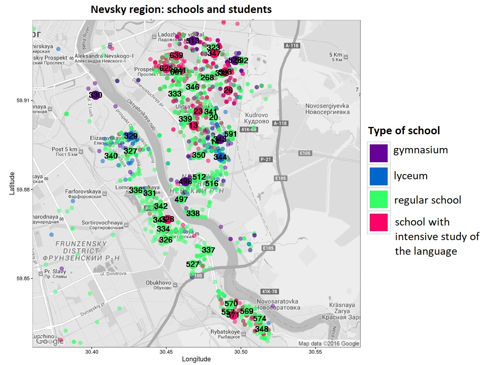
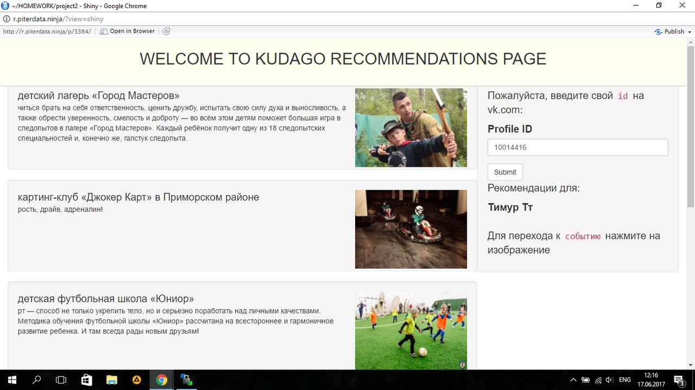

```{r setup, include=FALSE}
knitr::opts_chunk$set(echo = T, warning = F, cache = T, message = F)
```


```{r libs}
library(tidyverse)
library(lubridate)
library(janitor)
library(skimr)
library(igraph)
library(ggnet)
library(qgraph)
library(htmltools)
library(vembedr)

# library(googlesheets)
# token <- gs_auth(cache = FALSE)
# saveRDS(token, file = "googlesheets_token.rds")
# suppressMessages(gs_auth(token = "googlesheets_token.rds", verbose = FALSE))

theme_set(theme_minimal())
```


# Learning analytics

**Idea**: based on students' activity in virtual learning environment and survey of academic motivation and friendship indicate poor-performing students. 

## Collecting data

### Students' usernames  
```{r, results='asis'}
# minor2 = gs_title("Майнор 2 курс 2017-2018") %>% gs_read(ws = 'students') %>% rename(username = name) 
# minor2 %>% write_csv("~/minor2.csv")

minor2 = read_csv("~/minor2.csv")

# vle = gs_title("vle") %>% gs_read(ws = 'users')  
# vle %>% write_csv("~/vle.csv")
vle = read_csv("~/vle.csv") %>% select(username = Name, programme = программа, gender = Пол) %>% filter(username %in% minor2$username) %>% mutate(programme = factor(programme), gender = factor(gender))


vle = vle %>% mutate(programme = factor(programme))

levels(vle$programme) = c("vostok", "public", "hist", "log", "manag", "polit", "soc", "phil", "econ", "law")

minor2 = minor2 %>% left_join(vle)
#anonimized_names =

count(minor2, programme, sort = T) %>% knitr::kable()
```

213 students

### Attendance
```{r attendance}
attend = minor2 %>% select(username, `2017-09-19`:`2018-05-22`)
attend[is.na(attend)==T] = 0
attend = gather(attend, key = "day", value = "attendance", -username)
attend$attendance = ifelse(attend$attendance!=0, 1, 0)
attend$day  = as.Date(attend$day)
  
attend = attend %>% filter(attendance == 1) %>% count(username) %>% rename(attendance = n) %>% mutate(attendance = attendance/max(attendance)*100)

#ggplot(data = attend) + geom_histogram(aes(attendance)) + ggtitle("Distribution of students' attendance") + xlab("attendance, %")
```

### Grades 
```{r, eval = F}
grades_1semester = gs_title("2017-DS-2-1-Результаты 2к 1 семестр") %>% gs_read(ws = 'Final') 
grades_1semester = grades_1semester %>% select(username = name, test1 = midterm, test2 = Экзамен) 

grades_2semester = gs_title("2017-DS-2-2-Результаты") %>% gs_read(ws = 'FINAL') 
grades_2semester = grades_2semester %>% select(username = name, test3 = кр1, test4 = кр2)

grades = full_join(grades_1semester, grades_2semester) %>% drop_na(username) 
grades[is.na(grades)] = 0

grades = grades %>% mutate(grades_sum = test1+test2+test3+test4,
                           grades_sum = grades_sum/max(grades_sum)*100) %>% 
  select(username, grades_sum)

grades %>% write_csv("~/grades.csv")
```

```{r}
grades = read_csv("~/grades.csv")
#ggplot(grades %>% left_join(minor2)) + geom_histogram(aes(grades_sum, fill = programme)) + ggtitle("Attendance") + xlab("%")
```

### Students' background

```{r}
#accessing GPA for their first year of studies

ratings <- readxl::read_excel("/students/aabakhitova/shared/minor_research/data/ratings/рейтинги за 1 курс 3 когорта.xlsx")
ratings$programme = ratings$ОП %>% str_sub(27) %>% str_to_lower() %>% word(1)
ratings = ratings %>% select(ФИО, gpa_raw = `Средний балл`, programme)

#scaling by the educational programme
ratings = ratings %>% group_by(programme) %>% mutate(gpa_scaled = scales::rescale(gpa_raw, to = c(0,1))) %>% ungroup()

ratings = ratings %>% inner_join(minor2 %>% select(username, ФИО))

qplot(x = gpa_raw, data = ratings, geom = "histogram", main = "Previous success: who are our students?")
```


```{r}
ggplot(inner_join(grades, ratings) %>% filter(gpa_scaled>0), aes(gpa_scaled, grades_sum)) + geom_point() + geom_smooth() + ggtitle("How grades are connected to previous success")
```


### Survey 

```{bash, eval =  FALSE}
mongoexport --host mongo.piterdata.ninja --username USERNAME
st --password PASSWORD --db vle --collection q_answers --js]=onArray > opros_try.json
```

```{r}
surveys = jsonlite::fromJSON("~/shared/minor_research/opros_try.json")[-1] %>% select(`_user_name`,`_questionnaire_name`, everything())

c3w1 = surveys %>% filter(`_questionnaire_name`=="minor2017wave1") %>%
  janitor::remove_empty_cols() %>% select(-`_questionnaire_name`)

#renaming
q = read_csv("~/q.csv")

q3w1 = q %>% select(name = name_3, abrv) %>% drop_na()
x = data.frame(nam = names(c3w1), var = NA)
x$nam = x$nam %>% as.character()

for (i in 1:nrow(x)) {
  x$var[i] = ifelse(x$nam[i] %in% q3w1$name, q3w1$abrv[q3w1$name %in% x$nam[i]], x$nam[i])
}
names(c3w1) = x$var

x = c3w1 %>% count(username) %>% filter(n>1) %>% pull(username)
x = c3w1 %>% filter(username %in% x)

c3w1 = c3w1 %>% drop_na(choice2) %>% group_by(username) %>% 
  filter(timestamp == max(timestamp)) %>% unique() %>% ungroup()


#count means 
get_value = function(df, x) {
  s = dplyr::select(df, contains(x)) %>% map_df(~ as.numeric(.x)) %>% rowMeans()
  return(s)
}

for( i in c("int", "exp", "imp", "util")){
  c3w1[i] = get_value(c3w1, i)}

c3w1$cost_2 = c3w1 %>% dplyr::select(cost6, cost7) %>% map_df(~ as.numeric(.x)) %>% rowMeans()
c3w1$cost_1 = c3w1 %>% dplyr::select(cost1, cost2, cost3, cost4) %>% map_df(~ as.numeric(.x))%>% rowMeans()

survey = c3w1 %>% dplyr::select(username, c("int","cost_1", "cost_2", "exp", "imp", "util"))
```

```{r}
ggplot(survey %>% gather(key, value, -username)) + 
  geom_boxplot(aes(key, value)) + 
  ggtitle("Distribution of survey answers on academic motivation") + 
  xlab("components of motivation") + ylab("")
```


#### Friends: wave 1 and 2

```{r}
#short names for matching
cohort3_names = minor2 %>% select(username2 = username, ФИО)
cohort3_names$ФИО  = str_replace(cohort3_names$ФИО, " угли| оглы| кызы", "")

username = "username"
friends_string_to_df = function(df, username, friends, names_to_replace){
  tmp = cbind(df[as.character(username)], 
              str_extract_all(select(df, !!friends) %>% pull(), "[А-Я][а-я]+ [А-Я][а-я]+ [А-Я][а-я]+|[А-Я][а-я]+ [А-Я][а-я]+ -",  simplify = T)) %>% 
    as.data.frame()
  
  tmp = tmp %>% tidyr::gather(type, value, -!!username) %>% tidyr::drop_na() %>% dplyr::select(-type) %>% filter(str_length(value)>1) %>% 
    rename(ФИО = value)
  
  tmp = tmp %>% left_join(names_to_replace) %>% select(-ФИО)
  tmp = mutate(tmp, !!username := .data[[!!username]])
  return(tmp)
}

fr1 = friends_string_to_df(c3w1, "username", "friends", cohort3_names)

c3w2 = surveys %>% filter(`_questionnaire_name`=="minor2017wave2") %>% select(username = `_user_name`, friends = current_friend)
fr2 = friends_string_to_df(c3w2, "username", "friends", cohort3_names)
```

There are `r length(unique(fr1$username))` students who listed their friends from the same minor in a survey. In total we use information about `r length(unique(c(fr1$username2, fr1$username)))` to build a friendship network from Wave 1 of survey.

In the Wave 2 there were `r length(unique(fr2$username))` survey participants and total of `r length(unique(c(fr1$username2, fr1$username)))`students in the friendship network.

### Logs

```{r, eval = FALSE}
# Getting logs from the RStudio server 

code =str_c("/bin/cp /srv/store/principal/audit/r-console/", minor2$username, ".jsonl /principal/projects/minor_research/data/logs_3cohort/")
code= c("#!/bin/bash", code)

write_lines(code, "/principal/projects/minor_research/getlogs.sh")

#sudo
# cd /students/aabakhitova/shared/minor_research
#chmod o+x getlogs.sh
#./getlogs.sh

# json --> df 
parselogs = function(txt){
  df = str_c("/principal/projects/minor_research/data/logs_3cohort/", txt) %>% 
    readLines()
  map_df(c(1:length(df)), ~tryCatch( jsonResp <- jsonlite::fromJSON(df[.x]), error = function(e){NA}) %>% as.tibble())
}

list.names = list.files(path = "~/shared/minor_research/data/logs_3cohort/")
list.names 

logs = map_df(list.names, ~ parselogs(.x))
logs %>% write_csv("/principal/projects/minor_research/data/logs_3cohort/logs.csv")
```

```{r}
logs <- read_csv("/principal/projects/minor_research/data/logs_3cohort/logs.csv")
logs$timestamp = as.POSIXct(logs$timestamp/1000, origin = "1970-01-01", tz = "Europe/Moscow")  

logs = logs %>% 
  filter(timestamp > "2017-09-01 00:00:00"  & timestamp < "2018-06-30 23:59:59") %>% 
  filter(type %in% c("input", "error")) %>% drop_na(data)

logs  = logs %>% select(date = timestamp, type, username) %>% unique()

logs = logs %>% mutate(
                      wday = wday(date, label = T),
                      hour = hour(date),
                      week = week(date),
                      day = date(date))

#dates of classes
xdf = data.frame(time = names(minor2) %>% as.character(), day_class = 1 ) %>% filter(str_detect(time, "201[78]"))
xdf$timestamp = paste0(xdf$time, " 18:20:00") %>% ymd_hms()
xdf = xdf %>% filter(timestamp < "2018-04-09 13:23:45 UTC")
xdf$time = xdf$time %>% as.Date()
xdf$day_class[is.na(xdf$day_class)==T] = 0

logs_tue = logs %>% mutate(
  vt = ifelse(day %in% xdf$time & hour %in% c(9:18), "yes", "no")) %>% 
  select(-hour, -wday) %>% arrange(username, date)

#number of lines of code 
logs_count = logs_tue %>% filter(type == "input" & vt == "no") %>% count(username) %>% rename(logs = n) %>% mutate(logs_l = log(logs) + 1)

#percentage or errors during coding 
logs_wr = logs_tue %>% filter(type == "error" & vt== "no") %>% 
  count(username) %>% rename(logs_wr = n) 
logs_wr = logs_wr %>% left_join(select(logs_count, username, logs)) %>% 
  mutate(logs_wr_per = logs_wr/(logs+logs_wr)*100)

logs_metrics = logs_count %>% 
  left_join(logs_wr) 

logs_metrics = logs_metrics %>% select(username, logs = logs_l, logs_wr = logs_wr_per)
```

### Online course 

```{r}
#getting data from the platform for online courses Stepik.org
struct = read_csv("/students/aabakhitova/shared/minor_research/learning-behavior-analytics/diploma/course-3122-structure.csv")
struct_cycles = struct %>% filter(module_position %in% c(2:11, 19, 20, 22, 24, 25, 26),step_type != "text") 

# students' submissions
step_session = read_csv("/students/aabakhitova/shared/minor_research/learning-behavior-analytics/diploma/stepik2coh.csv") %>% filter(type =="correct"|type=="wrong", step_id %in% struct_cycles$step_id) %>% left_join(struct_cycles)

#struct_cycles$step_id %>% unique() %>% length() 222
session_stepik = step_session %>% filter(type == "correct") %>% select(username, step_id) %>% unique() %>%  
  group_by(username) %>% summarise(step_perc = n()/222*100 - 60)

stepik_wr = step_session %>% mutate(type2 = ifelse(type == "wrong", 1,0)) %>% group_by(username) %>% 
  summarise(n = n(), wr = sum(type2)) %>% mutate(step_wr = wr/n) %>% select(username, step_wr)

stepik  = session_stepik %>% 
  left_join(stepik_wr) 
```


## Analysis of students friendship network

During the second term of our 2-year specialisation, students are assigned to project groups so that the teams would be as diverse as possible in terms of grades and educational programmes to improve cross-programme student communication so that the access to the advice network and knowledge sharing became easier for underrepresented students from Humanities.

By analysing friendship networks of students we want to understand if our actions are actually helping students. 

```{r}
group_ids = minor2 %>% select(username, group = g, project_group = group_id)  

users = data_frame(username = c(fr1$username %>% as.character(), fr2$username, fr1$username2, fr2$username2)) %>% unique() %>% 
  left_join(group_ids) %>% left_join(vle)

drops = users %>% filter(is.na(group)) %>% pull(username)
users = users %>% drop_na() #187 студентов
users$programme = factor(users$programme)


fr1 = fr1 %>% filter(username %in% users$username, username2 %in% users$username)
fr2 = fr2 %>% filter(username %in% users$username, username2 %in% users$username)

#calculate number of friends
friends = fr1 %>% count(username2) %>% rename(username = username2, friends = n)


#make a graph object
#160
net1 <- graph_from_data_frame(
  d=fr1, 
  vertices=users %>% filter(username %in%fr1$username|username %in% fr1$username2),
  directed=T) %>% simplify()

#151
net2 <- graph_from_data_frame(
  d=fr2, 
  vertices=users%>% filter(username %in%fr2$username|username %in% fr2$username2),
  directed=T)  %>% simplify()

# make coordinates for the plotting networks
full_net = net1+net2
g = ggnet::ggnet2(full_net, alpha = 1, size = 4, edge.alpha = 0.8, color = "program", palette = "Set3", edge.size = 0.1)

coord = g$data %>% select(username = label, x, y) 
users = left_join(users, coord)

pr_col = c("vostok"="#8DD3C7", 
           "public" = "#FFFFB3", 
           "hist" = "#BEBADA", 
           "log" = "#FB8072", 
           "manag"= "#80B1D3", 
           "polit" = "#FDB462", 
           "soc" = "#B3DE69", 
           "phil" =  "#FCCDE5", 
           "econ" = "#D9D9D9", 
           "law" = "#BC80BD")
```

Plotting networks

```{r}
net1 <- graph_from_data_frame(d=fr1, vertices=users %>% filter(username %in%fr1$username|username %in% fr1$username2), directed=T) %>% simplify()

net2 <- graph_from_data_frame(d=fr2, vertices=users%>% filter(username %in%fr2$username|username %in% fr2$username2), directed=T)  %>% simplify()

g1 = ggnet::ggnet2(net1, mode = c("x", "y"), alpha = 1, size = 4, edge.alpha = 0.8, color = "programme", palette = pr_col, edge.size = 0.1) 

g2= ggnet::ggnet2(net2, mode = c("x", "y"), alpha = 1, size = 4, edge.alpha = 0.8, color = "programme", palette = pr_col, edge.size = 0.1) 

b = theme(panel.background = element_rect(color = "grey50"))
z = guides(color = FALSE)

gridExtra::grid.arrange(g1 + z + ggtitle("wave1") + b,
                        g2 + z + ggtitle("wave2") + b,
                        nrow = 1)
```

Calculating assortativity coefficients and p-value for them

```{r, results='hide'}
assortativity_nominal(net1,as.numeric(as.factor(V(net1)$programme)))#645
assortativity_nominal(net2,as.numeric(as.factor(V(net2)$programme)))#62

assortativity_nominal(net1,as.numeric(as.factor(V(net1)$project_group)))#-0.2
assortativity_nominal(net2,as.numeric(as.factor(V(net2)$project_group)))#1

assortativity_sign = function(gr, a){
  g = gr
  attribute_real = vertex_attr(g)[a] %>% unlist
  
  number_of_permutations = 3500
  assortativity_shuffled  <- rep(NA_real_, number_of_permutations)
  
  for(i in 1:number_of_permutations){
    V(g)$attr_shuffled = sample(attribute_real, replace = F)
    assortativity_shuffled[i] = assortativity_nominal(g,factor(V(g)$attr_shuffled %>% as.character()))
  }
  
  assortativity_real = assortativity_nominal(g,factor(vertex_attr(g)[a] %>% unlist))
  
  pvalue = sum(abs(assortativity_shuffled) >= abs(assortativity_real)) / number_of_permutations
  print(pvalue)
}
```


QAP correlation between networks

```{r}
net1_cor = delete_vertices(net1, V(net1)$name[!(V(net1)$name %in% V(net2)$name)])
net2_cor = delete_vertices(net2, V(net2)$name[!(V(net2)$name %in% V(net1)$name)]) 

mat_1 = net1_cor %>% igraph::as_adjacency_matrix() %>% as.matrix()
mat = net2_cor %>% igraph::as_adjacency_matrix() %>% as.matrix()
mat = mat[,colnames(mat_1)]
mat = mat[rownames(mat_1),]

g.indeps <- array(dim = c(2, 172, 172))
g.indeps[1,,] <- mat %>% as.matrix() 
g.indeps[2,,] <- mat_1 %>% as.matrix()
q.12<-sna:::qaptest(g.indeps,sna::gcor,g1=1,g2=2)
#summary(q.12)
# there is a significant correlation between two waves of 0.549
```


## What factors are connected to grades 

```{r, results='asis' }
#combining everything together  
df = vle %>% 
  left_join(ratings %>% select(username, gpa_scaled)) %>% 
  left_join(grades) %>% 
  left_join(survey) %>% 
  left_join(friends) %>% 
  left_join(logs_count) %>% 
  left_join(stepik) %>% select(-username) %>% drop_na()

df %>% skim() %>% skimr::kable()
```

### Exploring partial correlation between variables

We further explore the connection between lerning behaviour measures and self-reported survey data in connection to students' achievement.

```{r}
cor = qgraph::cor_auto(df[,-(1:2)] %>% drop_na())

glassoGraph <- qgraph(cor, graph = "glasso", sampleSize = nrow(df))
plot(glassoGraph)
# x = qgraph::getWmat(glassoGraph) %>% round(2)
# upper<-x
# upper[upper.tri(x)]<-""
# upper<-as.data.frame(upper)
# upper
```

### Finding important factors connected to grade
```{r, results="hide"}
library(caret)

sum(df$grades_sum>80)
df = df %>% mutate(grade = ifelse(grades_sum<70, "low", "high"))
fit.caret <- (train(
  grade ~ .-grades_sum, 
  data = df, 
  method = "gbm",
  trControl = trainControl(method = "cv", number = 5)))
```

### Why was this prediction made?
We trained a GBM model predicting students grades based on his learning behavior measures and academic motivation as well as his social capital measured by the number of friends.

We are interested here in finding cases there this model predicts grade with high and low probabilities (e.g. to understand there our model work best and worst) and understand that is so special about those cases. 


By using LIME for explainable ML we explore why a particular prediction was made for students of different levels of achievement.

```{r}
library(lime)

explainer_caret <- lime(df, fit.caret, n_bins = 5)

# explanation_gbm <- explain(df, explainer_caret, n_label = 1, n_features = 5)
# plot_features(explanation_gbm)
# 
# df0 = data.frame(label = explanation_gbm$label,
#                 prob = explanation_gbm$model_prediction,
#                 model_r2 = explanation_gbm$model_r2) %>% unique() %>% rowid_to_column()
# 
# df0 %>% group_by(label) %>% filter(model_r2 == max(model_r2) | model_r2 == min(model_r2))
# 
explanation_gbm2 <- explain(df[c(78,144,143,83),], 
                            explainer_caret, n_labels = 1, n_features = 10)
plot_features(explanation_gbm2)
```

We've got 4 students/cases: high probability of prediction on the left, low on the right. Cases where the model predicted good grades are on top and poor grades on the bottom. 

Let's consider Case 1. The model predicted high grade for this student and a large number of friends (>6), lines of code, GPA, and low expected costs contribute most to the probability of prediction (.16, .14, .14 and .11 respectively). Although, a small percentage of completed additional online exercises (stepik_perc) contribute negatively to the prediction (-.23), e.g. not supporting it. 

# Predicting crimes in Chicago 

**Idea**: build a model predicting a level of crimes based on the weather data in Chicago. 
I did this project during my introductory Python course in my masters. 

For the project I selected the Conditional Inference Tree for its interpretability. I combined three datasets from Kaggle - weather and crime data (on theft) from the police department for years 2012-2015. Additionally, I added holidays as they might have affected the level of crime on that day (and, in fact, they did). 

It turns out that information about the level of crimes on the previous day is more important than weather, but combined they can predict with up to 75% accuracy if in that day there will be more crimes than usual. Also, on Sundays and holidays there are fewer crimes compared to weekdays. 

Results were presented using GitHub Pages (unfortunately, it is in Russian): https://liddlle.github.io/chicago-crime/Html/chicago.html 

```{r, out.width = "100%", out.height= "700px", echo = F}
knitr::include_url("http://aabakhitova.piterdata.ninja/chicago.html")
```


# R sofrware ecosystem on GitHub

**Idea**: learn about OSS communities on the example of R ecosystem.
I started this project during the EMC Mentoring program and recently organized a project group at the Sociology and Social Informatics department at HSE.

**My input**:

* collecting data using GitHub API (also tried GitHub datadumps, Google Big Query, MariaDB) 
* cleaning and stuff
* building a collaboration network of developers (bipartite)
* analysing how fast the pull request of user is accepted based on his type (newcomer, old developer or project owners)

```{r, out.width = "100%", out.height= "400px", echo = F}
knitr::include_graphics("github_pres.pdf")
```

**Example of the code**: taken from my tutorial this year for 2- and 3-year Social Informatics students.

```{r, eval = F}
library(tidyjson)
library(httr)
library(tidyverse)
library(githubinstall)

# endpoint -- URL from which we request an information
# https://api.github.com/ 
oauth_endpoints("github")

# let's try this links 
#https://api.github.com/users/
#https://api.github.com/users/liddlle

# authorize your application 
myapp <- oauth_app(appname = "socinfo", # Application name
                   key = "", # client ID
                   secret = "") # client Secret 

# now we should get an access token 
# Use a local file ('.httr-oauth'), to cache OAuth access credentials between R sessions?-- NO
github_token <- oauth2.0_token(oauth_endpoints("github"), myapp)
gtoken <- config(token = github_token)


# GitHub API https://developer.github.com/v3


# how to make HTTP request  (GET or POST)
req <- GET("https://api.github.com/users/liddlle", gtoken)
req
#Status code == 200 if everything is okay


# let's get the content 
json1 = content(req, "text")

# make a table out of it
df = json1 %>% tidyjson::spread_all()
df

## Rate limiting 5000 requests per hour  

# what R packages are available on GitHub
r_urls = gh_list_packages()
head(r_urls)

# create URLs 
r_urls = r_urls %>% 
  mutate(
    url = paste("https://api.github.com/repos/", username, "/", package_name, sep = ""),
    url_normal = paste("https://github.com/", username, "/", package_name, sep = ""))

# we will take the first 10 of them for the sake of the example
r_urls2 = r_urls[1:10,]


#u = "https://api.github.com/repos/gagolews/stringi" 
repo_r2 = data.frame()

for (u in r_urls2$url[1:nrow(r_urls2)]) {
  repos = GET(u, github_token)
  repos2 = content(repos, "text")
  repos3 = repos2 %>% spread_all
  if (ncol(repos3)>5) {
    repo_r2 = plyr::rbind.fill(repo_r2, repos3)
    print(repos3$full_name)}
  Sys.sleep(1)
}

repo_r2
```


# Lyrics in Russian popular songs 

**Idea**: show that are popular Russian songs' lyrics all about as a final group project made during the Text Mining course on the 4-th year. 

With this project I presented a poster at the Russian School in Information Retreival (RuSIR) in 2018

**My input**:

* cleaning data, steming words
* matching words with dictionary-based sentiments 
* calculating repetitiveness of words in lyrics 
* analysing bi-grams with pronouns using TF-IDF 

**Some results**: Russian popular music has the same trend of decreasing in lyrics’ complexity as the foreign music. 

The worldwide tendency of gender stereotypes is also presented in Russian popular music. While men appear to be more active and dominant, women are prone to be passive. 

As for sentiments, there are more positive words than negative in Russian popular music. That confirms the Pollyanna principle that people are tend to use positive words more often. 

There is a restricted set of main topics used in Russian popular music. The main 2 topics are about love and the weather (in metaphorical way) like in foreign lyrics. Meanwhile, there are also some specific topics for Russian popular music such as “folk-related“ that represents the image of Russia (rivers, birches and so on), Russian Rock and Thieves’ topic about Russian prisoners’ life. 

```{r, out.width = "100%", out.height= "400px", echo = F}
knitr::include_graphics("russir.pdf")
```

# Panama Papers

**Idea**: make an exploratory analysis of Panama archives. Together with my groupmates we were interested in: 
  1) in which countries tax evasion is most popular? 
  2) which countries most likely to provide tax-evasion services to companies? 
  3) do companies have preference of countries for tax evasion? 

**My input**: particularly, I plotted the sankey plot of top 10 countries where companies are registered (on the left), and jurisdiction of countries (on the right). 

**Some results**:
For instance, Hong Kong is where most documented companies are located, and most of the companies have offshore companies of thiers in Virgin Islands. Speaking of jurisdiction, Virgin Islands are most popular tax haven in the Panama Papers. 

Although we haven’t profoundly examined why companies have certain patterns and preference to locate their operation and offshore companies, this graph shows there are certain patterns of company registration and seemingly this decision making is highly strategic and British empire still casts a huge shadow on this tax evasion matter. 

Results were obtained and presented during the Web Science Summer School in 2016 in Koblenz, Germany. 

**Group presentation**:

```{r, out.width = "100%", out.height= "400px", echo = F}
knitr::include_graphics("Panama papers.pdf")
```

# Schools in St.Petersburg 

**Idea**: understand how distance to the pupil’s home is connected to the school type. This was my 2-year university project. 

**My input**:

* cleaned and analysed survey data obtained by the Sociology of Science and Education Laboratory at HSE. Among other things, pupils who were studying in St.Petersburg were asked to fill in their home address.
* geocoding -- using Google Maps API to get longitude and latitude for each pupils' address
* mapping the results

Results revealed that more prestigious schools tend to attract students from more remote regions which we assume is connected to the parents choice and their SES.

Example of a map that I build:

```{r, out.width = "90%", echo = F}

```


# Recommending where to go

**Idea**: built a collaborative recommender system based on social media profiles as a final project at the Data Science minor.

**My input**: 

* collected the social profiles of users and their information (gender, age, groups...) using VK API  (vk.com)
* exploratory analysis of the data
* calculated similarities between the users (k-NN approach) based on their profiles.

Results were presented in the form of an interactive Shiny-application there based on your id in the social network you could get a recommendation of where to go.

Unfortunately, our app is no longer accessible, but here is our [project page](https://github.com/Liddlle/spbRecommend) and a screen of how the app looked:  

```{r, out.width = "70%", echo = F}

```

# Women Data Leaders project 

**Idea**: provide visible role models of women in Data Science for female students (both STEM and non-STEM) to increase gender diversity and women's participation in the Russian DS community. The project was supported by the ACM KDD Impact Program in 2018 and later JetBrains company joined us. 

**My input**: 

* I organized and collected 16 short interviews during WWW'18 and KDD'18 conferences. 
* Organized one guest lecture at HSE by Noa Yehezkel from NASA. 
* I curate the development of online course on DS made by students. Particularly, two online modules: studying music and friendship. 
* Ambassador of the WiDS St.Petersburg for the Women in Data Sciencs (WiDS) Conference in 2019. 

[youtube](https://www.youtube.com/channel/UCJ_QT37_2IST3F6wD1rZnGw)

[project website](http://wdl-hse.org/en)

This is our video presentation at KDD'18:

```{r, echo = F}
embed_url("https://www.youtube.com/watch?v=rHrtApdKuS8")
```

